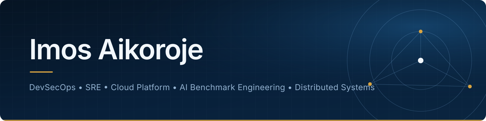

### Building secure infrastructure • Reliable platforms • Distributed systems • Frontier AI evaluation environments

[](https://www.linkedin.com/in/imosaikoroje/)
[](https://github.com/imos64)
[](https://github.com/imos64)


[](https://github.com/imos64/office/tree/main)


---

## 👨🏽‍💻 About Me

I am a **DevSecOps Engineer**, **Site Reliability Engineer**, **Cloud & Platform Engineer**, and **AI Benchmark Engineer** focused on secure production systems and hard technical evaluation environments.

My work spans **Kubernetes**, **cloud infrastructure**, **CI/CD**, **GitOps**, **observability**, **distributed systems**, **Hyperledger Fabric**, **microservices**, **RAG infrastructure**, **application security**, and **frontier AI evaluation**.

```text
Security + Reliability + Automation + Distributed Systems + AI Evaluation
```

- ☸️ Kubernetes and cloud platform engineering
- 🔐 DevSecOps, AppSec, IAM, and software supply-chain security
- 🔄 CI/CD, GitOps, release engineering, and Infrastructure as Code
- 📊 Prometheus, Grafana, distributed tracing, and operational alerting
- ⛓️ Hyperledger Fabric, consensus, ledger, identity, and chaincode infrastructure
- 🤖 Terminal-based agent benchmarks and Senior SWE benchmark review
- 🧪 Oracle, verifier, rubric, regression, and failure-analysis engineering
- 🧠 RAG gateways, multi-provider inference, and AI infrastructure

---

# 🌟 Featured Engineering Work

## 🧠 Keycloak–Fabric Bridge — Identity & API Integration

[](https://github.com/imos64/treetracker-blockchain-auth/tree/main)

My merged TreeTracker contribution integrates Keycloak authentication with Hyperledger Fabric identity operations.

**Keycloak • JWT authentication • Fabric CA • wallet management • API endpoints • Docker • security configuration**

---

## ⛓️ Hyperledger Fabric on Kubernetes

[](https://github.com/imos64/treetracker-infrastructure/tree/main)

Kubernetes-based Hyperledger Fabric infrastructure covering certificate authorities, peers, orderers, CouchDB, channels, connection profiles, and chaincode lifecycle.

**Grafana** = Fabric health and performance  
**Prometheus** = metrics collection  
**Alertmanager** = operational alerts  
**Hyperledger Explorer** = blockchain visibility

---

## 🌳 TreeTracker / HLF Enterprise Productionization

[](https://github.com/imos64/treetracker-infrastructure/tree/main)

Productionization work across the TreeTracker and Hyperledger Fabric stack:

- TreeTracker web, admin, authentication, capture, and token services
- Kubernetes and Argo CD GitOps
- GHCR image delivery
- PostgreSQL and Keycloak migration and persistence
- Fabric peers, orderers, CAs, CouchDB, and wallets
- Hyperledger Explorer and CouchDB Fauxton
- Headlamp, Prometheus, and Grafana
- Backup, restoration, credentials, and persistence documentation

---

## ⚙️ DevOps Engineering Portfolio

[](https://github.com/imos64/treetracker-wallet-app/tree/main)

My TreeTracker Wallet work covers GitHub Actions CI/CD, Docker builds, security scanning, SBOM generation, and Kustomize deployment overlays.

---

## 📊 Kubernetes Observability

[](https://github.com/imos64/prometheus-kubernetes/tree/main)
[](https://github.com/imos64/grafana-kubernetes/tree/main)
[](https://github.com/imos64/loki-kubernetes/tree/main)
[](https://github.com/imos64/alertmanager-kubernetes/tree/main)

My Kubernetes observability deployment repositories, derived from my running Hyperledger Fabric / TreeTracker stack. Each includes Helm charts, native Kubernetes manifests, Terraform and OpenTofu deployments, high-level architecture, and operations runbooks.

Validated in an isolated cluster: metrics collection, 15 Grafana dashboards, log ingestion and queries, alert handling, and persistence across pod restarts. Production profiles document their storage, identity, availability, and recovery requirements.

---

# 🤖 Frontier AI Benchmark Engineering


[](https://github.com/harbor-framework/terminal-bench)


The recovered [Harbor](https://github.com/harbor-framework/harbor) and TBench workspace contains **221 task/project directories after obvious template and test scaffolding are excluded**. I use this portfolio to demonstrate breadth across secure systems, software engineering, infrastructure, distributed systems, and AI-agent evaluation.

> **Portfolio accuracy note:** the 221 figure represents recovered task/project directories. It is not presented as 221 accepted benchmark submissions. Historical month grouping is based on current workspace timestamps and should be treated as an approximate timeline.

## 🧪 Terminal-Bench [1.0](https://github.com/harbor-framework/terminal-bench-1) / [2.0](https://github.com/harbor-framework/terminal-bench-2) / [2.1](https://github.com/harbor-framework/terminal-bench-2-1) / [3.0](https://github.com/harbor-framework/terminal-bench)

[](https://github.com/harbor-framework/terminal-bench-2)
[](https://github.com/harbor-framework/terminal-bench-2-1)
[](https://github.com/harbor-framework/terminal-bench)

Engineering work includes:

- Task authoring and proposal development
- Proposal grading and technical review
- Reviewer guidelines and calibration
- Packaging and external-submission work
- Containerized execution environments
- Oracle and reference-solution engineering
- Separate-verifier and acceptance-test hardening
- Rubric and behavioral validation
- Failure-mode and regression analysis
- Reproducibility and edge-case testing
- Multi-step agent tasks with interacting invariants

### 🔐 Selected AppSec, Identity & DevSecOps Tasks

`prevent-http-request-smuggling` • `fix-crlf-injection` • `prevent-open-redirect-abuse` • `automated-idor-discovery` • `prototype-pollution-deep-scan` • `xxe-payload-reconstruction` • `refresh-token-rotation` • `strict-jwt-validation` • `oauth-client-credential-rotation` • `dpop-proof-of-possession-for-high-risk-api-tokens` • `privileged-mfa-enforcement` • `credential-stuffing-defense-deployment` • `jwks-cache-hardening` • `password-reset-token-security` • `mfa-sign-in-bypass-fix` • `pr-from-fork-executes-secrets` • `docker-security-hardening-v4.6` • `http2-rapid-reset-vulnerability-assessment-tool_20260123_184244`

### ⛓️ Selected Hyperledger Fabric & Blockchain Tasks

`chaincode-access-control` • `ordering-service-disaster-recovery-security` • `peer-impersonation-prevention` • `secure-couchdb-or-leveldb-access` • `secure-peer-to-peer-gossip-channels` • `fabric-event-listener-security` • `prevent-cross-channel-data-leakage` • `prevent-identity-reuse-across-channels` • `raft-leader-election-abuse-detection` • `rotate-msp-configs-without-network-outage` • `transaction-integrity` • `transaction-signing-enforcement` • `chaincode-dependency-failure` • `fabric-plus-ferretdb-recovery` • `hlf-dynamic-peer-addition` • `multi-database-ledger-synchronization` • `multi-org-governance-conflict` • `peer-join-idempotency` • `raft-consensus-state-recovery` • `ci-cd-chaincode-deployment` • `ledger-replay-consistency` • `ledger-replay-into-ferretdb`

### 📊 Selected SRE, Cloud & Platform Tasks

`harden-cluster-creation` • `prevent-insecure-rollouts` • `sensitive-k8s-namespace-protection-model` • `shadow-infrastructure-detection` • `prometheus-grafana-monitoring` • `log-rotation-debugger` • `reproducible-rust-release-ci` • `block-risky-releases-before-they-hit-production` • `incident-containment-kill-switch-controls` • `disaster-recovery` • `autofix-prod-bugs` • `distributed-tracing-end-to-end` • `global-outage-simulation` • `perfect-observability` • `payment-api-capacity` • `payment-jvm-warmup` • `payment-microservice-warmup` • `selenium-grid-optimization` • `zero-downtime-iac-migration`

### 🌐 Selected Distributed Systems & Data Tasks

`chain-replication-log-repair` • `lamport-logical-clock-ordering-debugger` • `event-stream-repair` • `postgres-mixed-workload-optimization` • `event-ordering-collapse` • `multi-language-microservice-mesh` • `multi-subnet-identity-federation` • `unified-data-mesh-implementation` • `polyglot-data-processing-pipeline` • `collapse-repair` • `router-collapse-repair` • `reversal-guard`

### 🧠 Selected AI/ML & Research Tasks

`end-to-end-ml-trust-chain` • `integrate-security-scanning-into-ml-pipelines` • `isolate-unverified-models-before-promotion` • `protect-proprietary-models-from-theft` • `bank-marketing-ensemble` • `protein-interaction-mapper` • `bittensor-appstate-reconstruction` • `bittensor-data-platform` • `bittensor-validator-state-on-cassandra` • `gpu-resource-arbitration` • `real-time-ai-marketplace-integration` • `response-ranking-service` • `101B-learngene-tells-you-how-to-customize-task-aware-parameter-initialization-at-flexible-scales` • `124b-proxytransformation-preshaping-point-cloud-manifold-with-proxy-attention` • `gemini-embedding` • `harmonized-reasoning-pruning` • `learngene-customization` • `spargeattention-acceleration`

---

## 🛡️ Terminus 3 — AppSec Benchmark Development

Work included **AppSec task development** plus **separate-verifier hardening**.

Representative areas:

- HTTP request framing and request-smuggling defenses
- Header and CRLF injection defenses
- Redirect safety
- Signed metadata replay protection
- Security boundary validation
- Independent verifier behavior

---

## 📚 PaperBench+ — Research Reproduction & GPU Tasks

Worked on **paper-reproduction** and **CUDA/GPU task development**.

Research-oriented task areas include:

- LearnGene task-aware parameter initialization
- ProxyTransformation point-cloud manifold work
- Harmonized reasoning pruning
- SpargeAttention acceleration
- GPU resource arbitration

---

## 🧠 Senior SWE-Bench


Repository-scale review work includes:

| Project         | Recovered task/work                                          |
| --------------- | ------------------------------------------------------------ |
| **Better Auth** | `better-auth-pr9059-fix` plus prior `better-auth-pr9930-feature` history |
| **Prefect**     | `prefect-pr19962-fix`, `prefect-pr22113-fix`, `prefect-pr22404-fix` |
| **PostHog**     | `posthog-pr48403-fix`                                        |

Core evaluation skills include repository investigation, production-fix review, regression validation, acceptance criteria, verifier behavior, and coding-agent failure analysis.

---

## 🎮 Wordle AI Benchmark


LLM benchmarking environment for strategic reasoning with:

**OpenRouter • LiteLLM • local vLLM • concurrent evaluation • cost tracking • token analysis • model trajectories • success-rate analytics**

---

## 📄 ExtractBench


Schema-guided enterprise document extraction benchmark covering structured-output accuracy, completeness, grounding, and model evaluation.

---

# 🗂️ Full Recovered Benchmark Task / Project Catalog — 221

<details>
<summary><strong>Expand the complete recovered Harbor & TBench inventory</strong></summary>

<br/>

The month labels below use current directory timestamps as the best available historical marker. They are **not guaranteed creation dates**.

### December 2025 — 56

`adjust-cloud-policies-based-on-threat-signals` • `application-secrets-boundaries` • `appsec-pipeline-self-test` • `asorb-volumetric-attacks-safely` • `automated-idor-discovery` • `block-exploits-without-redeploying-workloads` • `chaincode-access-control` • `cloud-cost-security-risk-framework` • `cloud-threat-detection-integration` • `code-maintenance-refactoring-and-optimization` • `cross-cloud-identity-federation-blueprint` • `crypto-boundary-mapping` • `dast-scan-not-triggering` • `data-masking` • `detect-malicious-crash-loops` • `detect-sso-flaws` • `encrypt-ledger-data-at-rest` • `end-to-end-ml-trust-chain` • `harden-cluster-creation` • `hello-world` • `immutable-infrastructure-enforcement-blueprint` • `implementing-continuous-threat-exposure-management` • `improve-throughput` • `integrate-security-scanning-into-ml-pipelines` • `isolate-unverified-models-before-promotion` • `kernel-level-runtime-guards` • `load-balancer-waf-integration` • `multi-tenant-isolation-broken` • `oauth-device-code-hijack` • `ordering-service-disaster-recovery-security` • `peer-impersonation-prevention` • `pevent-wildcard-origin-abuse` • `pipeline-resource-abuse-detection` • `pr-from-fork-executes-secrets` • `prevent-insecure-rollouts` • `protect-control-components` • `protect-proprietary-models-from-theft` • `prototype-pollution-deep-scan` • `remove-instances-without-impact` • `rsa-key-management` • `runtime-auto-containment` • `secrets-governance-as-code` • `secure-cloud-landing-zone` • `secure-couchdb-or-leveldb-access` • `secure-peer-to-peer-gossip-channels` • `security-stage-skipped-on-hotfix` • `security-tool-rationalization` • `sensitive-k8s-namespace-protection-model` • `serverless-security-reference-architecture` • `service-to-servic-identity` • `shadow-infrastructure-detection` • `test-defenses-under-attack` • `threat-prioritization-engine` • `track-transitive-risks` • `vulnerability-sla-enforcement-engine` • `xxe-payload-reconstruction`

### January 2026 — 22

`anti-enumeration-auth-responses` • `auth-endpoint-waf-hardening` • `auth-event-logging-hardening` • `centralized-sso-for-admin-access` • `contact-change-step-up-security` • `credential-stuffing-defense-deployment` • `dast-staging-gate` • `dpop-proof-of-possession-for-high-risk-api-tokens` • `jwks-cache-hardening` • `oauth-client-credential-rotation` • `oauth2-oidc-best-practices-enforcement` • `passkeys-web-authn-enablement` • `password-policy-enforcement` • `password-reset-token-security` • `prevent-privilege-escalation-via-idp-claims` • `privileged-mfa-enforcement` • `refresh-token-rotation` • `risk-based-authentication` • `sensitive-action-re-authentication` • `signup-and-password-reset-abuse-controls` • `strict-jwt-validation` • `threat-intelligence-integration`

### February 2026 — 56

`astronomical-observatory-scheduler` • `backdated-posting-prevention` • `bank-marketing-ensemble` • `card-pan-tokenization-strategy` • `chain-replication-log-repair` • `cobol-insurance-discount-validator` • `configure-bazel-remote-cache` • `convoy` • `core-banking-zero-trust-blueprint` • `cpp-concurrent-map-segfault-debug-20260107-100522` • `csv-eda` • `detect-live-exploitation-attempts` • `docker-security-hardening-v4.6` • `environment-dbpeil` • `fabric-event-listener-security` • `fake-job-postings` • `firewall-port-knock-setup` • `flake8-plugin` • `game5-30` • `game_last_stand` • `heat-exchanger-network-optimizer` • `hospital-lab-auditor` • `hsm-backed-key-management-blueprint` • `http2-rapid-reset-vulnerability-assessment-tool_20260123_184244` • `implement-bloodhound-acl-parser_20260127_190114` • `lamport-logical-clock-ordering-debugger` • `log-rotation-debugger` • `masscan` • `merge-debug-task` • `monorepo-static-analysis-strict` • `multi-factory-batch-optimizer` • `multi-vendor-cve-policy-hardening-2025_20260111_160349` • `network-forensics-analysis` • `password-hashing-hardening` • `pbn-bridge-submission` • `prevent-cross-channel-data-leakage` • `prevent-identity-reuse-across-channels` • `progressive-login-throttling-and-backoff` • `prometheus-grafana-monitoring` • `protein-interaction-mapper` • `raft-leader-election-abuse-detection` • `replica-placement-optimizer` • `reproducible-rust-release-ci` • `rotate-msp-configs-without-network-outage` • `scim-jit-provisioning-and-automated-deprovisioning` • `secrets-runtime-revocation` • `security-posture-attack-surface-reduction` • `sub-rev13-4` • `system-service` • `system-utlization` • `tbrain-elf-ret2win-root-shell` • `token-binding-via-mtls-or-dpop` • `transaction-integrity` • `transaction-signing-enforcement` • `video-transcoding-pipeline-3` • `wire-transfer-callback-validation`

### March 2026 — 18

`atm-transaction-integrity-monitoring` • `block-risky-releases-before-they-hit-production` • `cyber-resilience-under-kinetic-attack` • `detect-compromised-operator-credentials` • `event-stream-repair` • `incident-containment-kill-switch-controls` • `iso-20022-message-integrity-enforcement` • `maintain-integrity-under-solar-storms` • `pin-translation-hardening` • `secure-c4isr-architecture-validation` • `secure-satellite-link-encryption` • `secure-tactical-cloud-deployment-model` • `space-robotics-remote-takeover-prevention` • `spacecraft-firmware-tamper-prevention` • `ssh-ca-bastion-setup` • `strategic-cyber-escalation-safeguards` • `test-dynamic-threat-intelligence-integration` • `visualize-high-risk-services-and-accounts`

### April 2026 — 7

`auto-code-fix` • `collapse-repair` • `disaster-recovery` • `dynamic-threat-intelligence-integration` • `postgres-mixed-workload-optimization` • `reversal-guard` • `router-collapse-repair`

### May 2026 — 35

`autofix-prod-bugs` • `bittensor-appstate-reconstruction` • `bittensor-data-platform` • `bittensor-validator-state-on-cassandra` • `chaincode-dependency-failure` • `custom-incentive-engine` • `distributed-tracing-end-to-end` • `event-ordering-collapse` • `fabric-plus-ferretdb-recovery` • `fx-settlement-surge` • `global-outage-simulation` • `gpu-resource-arbitration` • `hlf-dynamic-peer-addition` • `mainframe-to-cloud-migration` • `mfa-sign-in-bypass-fix` • `miner-reputation-persistence` • `modular-platform-refactor` • `monolith-decomposition` • `multi-database-ledger-synchronization` • `multi-language-microservice-mesh` • `multi-org-governance-conflict` • `multi-subnet-identity-federation` • `payment-api-capacity` • `payment-jvm-warmup` • `payment-microservice-warmup` • `peer-join-idempotency` • `perfect-observability` • `policy-enforcement` • `raft-consensus-state-recovery` • `real-time-ai-marketplace-integration` • `response-ranking-service` • `trading-card-game-rules-engine` • `two-way-coupled-fluid-sim` • `unified-data-mesh-implementation` • `wallet-identity-federation`

### June 2026 — 7

`ci-cd-chaincode-deployment` • `electric-fix-sync-service-fix-hard` • `ledger-replay-consistency` • `ledger-replay-into-ferretdb` • `polyglot-data-processing-pipeline` • `selenium-grid-optimization` • `zero-downtime-iac-migration`

### July 2026 — 12

`101B-learngene-tells-you-how-to-customize-task-aware-parameter-initialization-at-flexible-scales` • `124b-proxytransformation-preshaping-point-cloud-manifold-with-proxy-attention` • `better-auth-pr9059-fix` • `edi-to-modern-api-bridge` • `gemini-embedding` • `gimp-sdk-api-compatibility-debugger` • `posthog-pr48403-fix` • `prefect-pr19962-fix` • `prefect-pr22113-fix` • `prefect-pr22404-fix` • `speedrun-friendly-engine` • `speedrun-friendly-engine-advanced`

### August 2026 — 8

`canonical-metadata-headers` • `fix-crlf-injection` • `harmonized-reasoning-pruning` • `learngene-customization` • `prevent-http-request-smuggling` • `prevent-open-redirect-abuse` • `secure-signed-metadata-replay` • `spargeattention-acceleration`

### Previous names / retired directories recovered from history

`auto-fix-production-bugs` → `autofix-prod-bugs`  
`canonical-export-metadata-headers` → `canonical-metadata-headers`  
`cross-team-policy-enforcement`, `policy-enforcement-may12`, `policy-enforcement-may25` → `policy-enforcement` family  
`eliminate-crlf-header-injection` → `fix-crlf-injection`  
`eliminate-http1-framing-desync`, `normalize-conflicting-http-request-framing` → `prevent-http-request-smuggling`  
`124B ProxyTransformation point-cloud completion with proxy operations` → later manifold/proxy-attention version

Other older or no-longer-present directories:

`86-proxytransformation-preshaping-point-cloud-completion-with-proxy-operations` • `better-auth-pr9930-feature` • `ci-hermetic-enforcer` • `sql-injection-defense` • `video-transcoding-pipeline` • `tactical-cloud-validator`

</details>

---

# ☸️ Kubernetes & Platform Engineering

[](https://github.com/imos64/office/tree/main)
[](https://github.com/imos64/prometheus-kubernetes/tree/main)

[](https://github.com/imos64/office/tree/main)


[](https://github.com/imos64/prometheus-kubernetes/tree/main)

---

# 🔐 DevSecOps & Security Engineering


**Focus:** AppSec • IAM • OAuth/OIDC • JWT • DPoP • mTLS • container security • secret detection • CI/CD security • Kubernetes security • TLS • secure software delivery • runtime protection • supply-chain security

---

# 🏗️ Broader Engineering Portfolio

## 🔧 Fixam4me

Application and Kubernetes/platform engineering for a service marketplace platform.

## 🛡️ Quantus Immunefi Security Audit

Security audit work included **CLI transfer** and **cold-signing attack surfaces**.

## ☸️ Kubernetes Maintenance

`kind-dev` maintenance work included **zero-ready ReplicaSet cleanup** and cluster troubleshooting.

## 🖥️ Systems Diagnostics

Windows/WSL performance and disk-storage diagnostics.

---

# 🛠️ Technology Stack

### Cloud • Infrastructure • Platform

[](https://github.com/imos64/setup-guide/tree/main)

[](https://github.com/imos64/office/tree/main)

[](https://github.com/imos64/prometheus-kubernetes/tree/main)
[](https://github.com/imos64/prometheus-kubernetes/tree/main)
[](https://github.com/imos64/prometheus-kubernetes/tree/main)


### CI/CD • Observability • Security

[](https://github.com/imos64/prometheus-kubernetes/tree/main)

[](https://github.com/imos64/prometheus-kubernetes/tree/main)
[](https://github.com/imos64/grafana-kubernetes/tree/main)


### Development • Data • AI

[](https://github.com/imos64/devops/tree/main)


[](https://github.com/imos64/mysql-high-availability/tree/main)


### Distributed Systems • Blockchain

[](https://github.com/imos64/treetracker-infrastructure/tree/main)


---

# 📈 GitHub Activity


---

# 🎯 Current Engineering Focus

- Production-grade Hyperledger Fabric on Kubernetes
- Automated cryptographic material and certificate lifecycle management
- Fabric observability with Prometheus, Grafana, and Alertmanager
- Kubernetes platform engineering and GitOps
- Secure CI/CD and AppSec automation
- AI-agent evaluation and benchmark engineering
- RAG infrastructure and multi-provider inference
- Cloud-native microservices and distributed systems

---

## 🤝 Let's Connect

I am interested in **DevSecOps**, **SRE**, **cloud infrastructure**, **AI systems**, **distributed systems**, **security engineering**, and **platform engineering** opportunities and collaborations.

[](https://www.linkedin.com/in/imosaikoroje/)

### Build securely • Operate reliably • Automate intelligently


